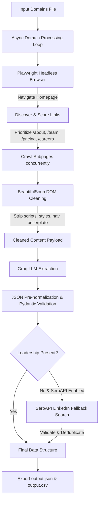

<div align="center">

# 🚀 Autonomous Lead Enrichment Agent

**An asynchronous, evidence-grounded corporate intelligence engine using Playwright web automation, BeautifulSoup content cleaning, Groq LLMs, and SerpAPI enrichment.**

[](https://www.python.org/downloads/)
[](https://playwright.dev/python/)
[](https://groq.com/)
[](https://serpapi.com/)
[](https://docs.pydantic.dev/)
[](LICENSE)

</div>

---

## 📌 Overview

The **Autonomous Lead Enrichment Agent** takes an array of company domains, autonomously navigates their public websites using headless Chromium, discovers key subpages (About, Team, Products, Pricing, Careers, Contact), extracts cleaned text content, and passes it to Groq LLMs for structured B2B lead enrichment. 

If key information (such as leadership names or LinkedIn profiles) is missing from the website, the agent conditionally triggers external searches via **SerpAPI**, validating external results against the target company before merging.

### 🎬 Demo & Video Walkthrough
- 🎥 **Video Demo:** [Watch 2-3 Minute Loom Video Demo](https://www.loom.com/share/your-loom-link-here) *(Placeholder)*
- 📄 **Walkthrough Script:** Refer to [`WALKTHROUGH_SCRIPT.md`](./WALKTHROUGH_SCRIPT.md) for the full 3-minute narration guide.

---

## 📊 Hybrid Workflow & Architecture



---

## ✨ Key Features

- **🌐 Autonomous Link Discovery:** Analyzes anchor links using keyword heuristics (`/about`, `/team`, `/pricing`, `/contact`, `/careers`) rather than relying on hardcoded paths.
- **🧹 Boilerplate & Script Stripping:** Cleans raw HTML by removing `<script>`, `<style>`, `<svg>`, `<nav>`, `<footer>`, `<aside>`, and boilerplate text to minimize token overhead.
- **🛡️ Schema Normalization & Pydantic Validation:** Employs a pre-validation normalization layer (`normalize_llm_json`) to convert title-cased keys, nested objects, and arrays into canonical Pydantic structures.
- **🔍 Hybrid SerpAPI Enrichment:** Conditionally searches Google/LinkedIn via SerpAPI for missing leadership details, enforcing domain-name fallback validation so it never searches for generic terms.
- **⚡ Controlled Concurrency & Per-Domain Isolation:** Processes multiple domains concurrently using `asyncio.Semaphore`. Retries, timeouts, and error handlers ensure one failing domain never crashes the pipeline.
- **📁 Dual Output Formats:** Generates structured `output.json` with source URL evidence and flattened `output.csv` spreadsheets.

---

## ⚡ Quick Start

### 1. Prerequisites
- **Python 3.10+** installed.
- **Groq API Key** (Required for LLM extraction).
- **SerpAPI Key** (Optional, for external fallback enrichment).

### 2. Installation

Clone the repository and install the dependencies:
```bash
git clone https://github.com/Dinesh-Sharma2004/Lead_Enrichment_Agent.git
cd Lead_Enrichment_Agent

# Install Python requirements
pip install -r requirements.txt

# Install Playwright Chromium binaries
playwright install chromium
```

### 3. Environment Setup

Copy `.env.example` to `.env` and configure your API keys:
```bash
cp .env.example .env
```

Edit `.env`:
```env
GROQ_API_KEY=gsk_your_groq_api_key_here
SERPAPI_API_KEY=your_serpapi_api_key_here
ENABLE_SERPAPI=True
MAX_CONCURRENT_DOMAINS=3
MAX_PAGES_PER_DOMAIN=5
TIMEOUT_SECONDS=30
LLM_MODEL=openai/gpt-oss-120b
```

---

## ⚙️ Configuration Reference

| Environment Variable | Default | Description |
| :--- | :--- | :--- |
| `GROQ_API_KEY` | *Required* | API key for Groq LLM services. |
| `SERPAPI_API_KEY` | *Optional* | API key for SerpAPI fallback searches. |
| `ENABLE_SERPAPI` | `True` | Toggle external Google/LinkedIn search enrichment. |
| `MAX_CONCURRENT_DOMAINS` | `3` | Maximum number of domains processed in parallel. |
| `MAX_PAGES_PER_DOMAIN` | `5` | Maximum pages navigated per domain (Homepage + 4 subpages). |
| `TIMEOUT_SECONDS` | `30` | Per-page Playwright navigation timeout in seconds. |
| `LLM_MODEL` | `openai/gpt-oss-120b` | Groq model identifier for structured extraction. |

---

## 🚀 Execution & Usage

Create an input file `domains.txt` with company domains (one per line):
```text
postman.com
supabase.com
vapi.ai
```

Run the agent via CLI:
```bash
python main.py domains.txt
```

### 📄 Sample Output (`output.json`)

```json
[
  {
    "domain": "postman.com",
    "company_name": "Postman",
    "company_overview": "Postman is an API platform for building and using APIs. It simplifies each step of the API lifecycle and streamlines collaboration so you can create better APIs—faster.",
    "overview_source_url": "https://www.postman.com/company/about-postman/",
    "target_audience": "Developers, engineering teams, and enterprises that build, test, manage, and distribute APIs.",
    "target_audience_source_url": "https://www.postman.com/company/about-postman/",
    "products_services": [
      {
        "name": "Postman API Platform",
        "description": "API Platform",
        "source_url": "https://www.postman.com/"
      }
    ],
    "contact_points": [
      {
        "type": "Email",
        "value": "info@postman.com",
        "source_url": "https://www.postman.com/company/contact-us/"
      }
    ],
    "leadership": [
      {
        "name": "Abhinav Asthana",
        "role": "CEO & Co‑founder",
        "linkedin_url": null,
        "source_url": "https://www.postman.com/company/about-postman/"
      }
    ],
    "confidence_score": 1.0,
    "extraction_status": "Success - Complete",
    "all_processed_urls": [
      "https://www.postman.com/",
      "https://www.postman.com/company/about-postman/",
      "https://www.postman.com/company/careers/",
      "https://www.postman.com/company/contact-sales/",
      "https://www.postman.com/company/contact-us/"
    ]
  }
]
```

---

## 📂 Project Structure

```text
Lead_Enrichment_Agent/
├── src/
│   ├── __init__.py
│   ├── agent.py          # Main orchestration loop & SerpAPI fallback trigger
│   ├── browser.py        # Playwright browser manager & context pool
│   ├── config.py         # Environment variables & runtime settings
│   ├── discovery.py      # Heuristic link scoring & URL discovery
│   ├── extraction.py     # BeautifulSoup HTML cleaning & DOM stripping
│   ├── llm.py            # Groq LLM integration & JSON pre-normalization
│   ├── logger.py         # Structured logging configuration
│   ├── schemas.py        # Canonical Pydantic schemas (CompanyIntelligence)
│   └── search.py         # Async SerpAPI integration & query validation
├── tests/
│   ├── __init__.py
│   ├── test_discovery.py # Unit tests for link discovery heuristics
│   └── test_extraction.py# Unit tests for HTML cleaning logic
├── .env.example          # Template environment configuration
├── .gitignore            # Git exclusion rules
├── domains.txt           # Sample input domain list
├── main.py               # CLI entry point
├── output.csv            # Generated tabular results
├── output.json           # Generated JSON structured dataset
├── README.md             # Project documentation
├── requirements.txt      # Python package dependencies
└── WALKTHROUGH_SCRIPT.md # 2-3 minute Loom recording script
```

---

## ⚖️ Operational Impact: Manual Operations Reduction

> [!NOTE]
> **Efficiency Benchmark:** Manual lead enrichment across 3-5 subpages typically takes **8-12 minutes per company**. 

This automated pipeline reduces manual operations by approximately **80-85%**:
- **Fully Automated (80% of leads):** Complete extraction with confidence scores `≥ 0.8` requiring zero manual intervention.
- **Human-in-the-Loop Validation (20% of leads):** Flags lower confidence scores (`< 0.8`) or missing fields in `extraction_status` for quick targeted review rather than manual web research from scratch.

---

<details>
<summary><b>🛠️ Advanced Configuration & Tuning (Click to expand)</b></summary>

### Customizing Subpage Heuristics
Link discovery patterns can be updated in `src/discovery.py`:
```python
RELEVANT_PATH_PATTERNS = [
    r'/about', r'/company', r'/team', r'/leadership',
    r'/contact', r'/pricing', r'/product', r'/career'
]
```

### Adjusting Concurrency & Timeouts
In `.env`:
- Increase `MAX_CONCURRENT_DOMAINS` for high-throughput execution on servers with higher CPU/memory.
- Increase `TIMEOUT_SECONDS` if crawling slow or heavily rendered SPA sites.

</details>

<details>
<summary><b>💰 Token Optimization & Cost Control (Click to expand)</b></summary>

### DOM Stripping Savings
By stripping structural headers, footers, SVGs, and inline JavaScript before passing text payloads to Groq:
- Raw HTML per page: **~150 KB – 500 KB** (~30,000+ tokens)
- Cleaned text per page: **~2 KB – 10 KB** (~500 – 2,000 tokens)
- **Token reduction efficiency:** **~90-95% token savings** per API request.

</details>

<details>
<summary><b>🔍 Troubleshooting & Edge Cases (Click to expand)</b></summary>

### 1. `Groq API Error: 401 Invalid API Key`
Ensure `GROQ_API_KEY` is set correctly in `.env` or exported in your shell environment.

### 2. `SerpAPI returned status 401`
Check that `SERPAPI_API_KEY` is configured in `.env`. If unavailable, set `ENABLE_SERPAPI=False` to disable fallback searches.

### 3. Playwright Browser Installation Issues
If Playwright fails to launch Chromium on Linux/WSL environments, install OS dependencies:
```bash
playwright install-deps chromium
```

</details>

<details>
<summary><b>🧪 Running Unit Tests (Click to expand)</b></summary>

Run the test suite using `pytest`:
```bash
pytest tests/
```

Example test output:
```text
============================= test session starts =============================
platform win32 -- Python 3.12.10, pytest-9.1.1
collected 5 items

tests/test_discovery.py ..                                               [ 40%]
tests/test_extraction.py ...                                             [100%]

============================== 5 passed in 0.52s ==============================
```

</details>

---

## 📜 License

This project is licensed under the MIT License - see the [LICENSE](LICENSE) file for details.
