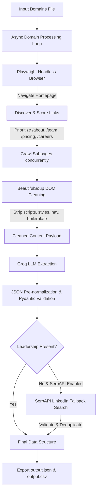

# System Architecture & Workflow

The Autonomous Lead Enrichment Agent utilizes a hybrid asynchronous pipeline combining headless Chromium browser automation, heuristic link discovery, DOM cleaning, Groq LLM extraction, and conditional SerpAPI fallback search.

## Hybrid Pipeline Diagram

## Modular System Components

### 1. Browser Manager (`src/browser.py`)
- Launches headless Chromium contexts asynchronously using Playwright.
- Manages dynamic page load timeouts (30s default) and page scrolling for lazy-loaded DOM elements.
- Enforces max browser concurrency via `asyncio.Semaphore`.

### 2. URL Discovery Heuristics (`src/discovery.py`)
- Extracts all internal links from the homepage.
- Ranks links using keyword heuristics (`/about`, `/team`, `/company`, `/pricing`, `/contact`, `/careers`).
- Selects top prioritized URLs up to `MAX_PAGES_PER_DOMAIN`.

### 3. HTML Extraction & DOM Cleaning (`src/extraction.py`)
- Parses HTML using `BeautifulSoup`.
- Strips noise elements (`<script>`, `<style>`, `<svg>`, `<nav>`, `<footer>`, `<header>`, `<aside>`, `<iframe>`).
- Extracts deduplicated clean text, drastically reducing token overhead.

### 4. Groq LLM Integration & Schema Pre-normalization (`src/llm.py`)
- Calls Groq API (`openai/gpt-oss-120b`).
- Passes clean text alongside an explicit JSON Schema system prompt.
- Employs `normalize_llm_json()` to handle lowercasing keys, unwrapping nested objects, and computing data confidence scores (0.0 to 1.0).

### 5. SerpAPI Enrichment (`src/search.py`)
- Triggers fallback search when leadership data is missing from website pages.
- Validates target company identity before searching to avoid generic search queries.
- Merges external LinkedIn leadership data into the canonical output.
